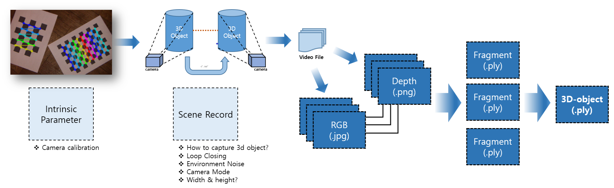
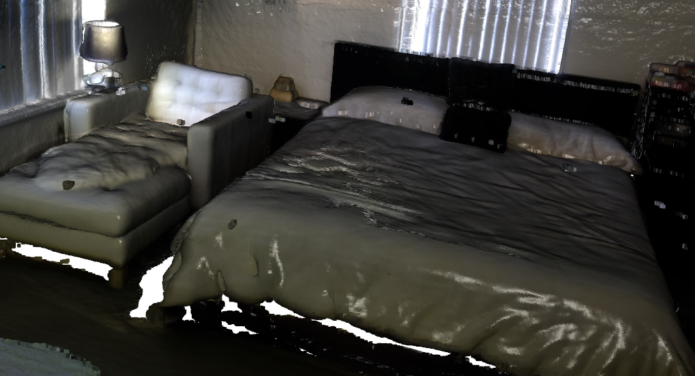

# 3d-reconstruction-processing---intel-LiDAR-Sensor
3d reconstruction use LiDAR sensor

## Hardware Information (datasheet)


| Features |  |  |  
| ------- | --- | --- |
|  *Use Environment* | *Technology* | *Ideal range* |
| Indoor | Laser Scanning | .25m to 9m (Range affected by reflectivity) |

| Depth |  |  |  | | |
| ------- | --- | --- | --- | --- | --- |
|  *Depth technology* | *Depth Field of View (FOV)* | *Minimum depth distance (Min-Z) at max resolution* | *Depth output resolution* | *Depth Accuracy* | *Depth frame rate* |
| LiDAR | 70° × 55° (±3°) | ~25cm | Up to 1024*768 | ~5 mm to ~14 mm thru 9m**2 | 30fps |

| RGB | | | | | 
| ------- | --- | --- | --- | --- |
| *RGB frame resolution* | *RGB sensor FOV(H\*V)* | *RGB frame rate* | *RGB sensor resolution* | *RGB sensor technology* |
| 1920 * 1080 | 70° × 43° (±3°) | 30 fps | 2 MP | Rolling Shutter |

| Major Components | | 
| --- | --- |
| *Processing* | *Optical Board* |
| Intel RealSense Vision ASIC | Laser & MEMS Mirror |

| Physical | | | |
| --- | --- | --- | --- |
| *Form Factor* | *Connectors* | *Diameter \* Height* | *Mounting mechanism* |
| Camera Peripheral | USB-C\*3.1 Gen 1\* | 61mm * 26 mm | One 1/4‑20 UNC thread mounting point. & Two M3 thread mounting points. & Tripod

** reference : https://www.intelrealsense.com/lidar-camera-l515/

## Process work



```
1. Hardware Settings
- Intrinsic Parameter
- LiDAR depth limit(?)
- Etc.
2. Export data (image & depth)
- export RGB(.jpg) & Depth (.png)
3. Make Fragments (.ply)
4. Make 3D-Object
```

## Environment settings

- Python 3.8, open3d 0.15.1 with conda environment 
```bash
conda create -n ro3d python=3.8
conda activate ro3d
pip install open3d
pip install joblib
pip install pyrealsense2
pip install opencv-python
```

## Open3d reconstruction example


- sample execution
```bash
git clone https://github.com/isl-org/Open3D
# open3d dir path set
cd open3d/
open3d_root=$(pwd)
cd examples/python/reconstruction_system
# config file path set
config_file=$open3d_root"/examples/python/reconstruction_system/config/tutorial.json"
# dataset download
# link : https://drive.google.com/file/d/11U8jEDYKvB5lXsK3L1rQcGTjp0YmRrzT/view
# you have to download dataset
# and then dataset will be unzip on datasets/016
# you should be change json file --> $config_file dataset path
# python run_system.py [config_file] [--make] [--register] [--refine] [--integrate]
run_system=$open3d_root"/examples/python/reconstruction_system/run_system.py"
cd $open3d_root
python $run_system $config_file --make
python $run_system $config_file --register
python $run_system $config_file --refine
python $run_system $config_file --integrate
python $run_system $config_file --slac
python $run_system $config_file --slac_integrate
```
- visualizing output result
```bash
cd $open3d_root && cd ..
python visualizer.py --filename datasets/016/slac/0.050/output_slac_pointcloud.ply
python visualizer.py --filename datasets/016/scene/integrated.ply
```



## Create Own Dataset

- recording use sample python file
```

```

## 3D recon result from own dataset


# Reference
- Paper
```
```
- Blog Posting & Etc.
```
- https://www.intelrealsense.com/lidar-camera-l515/
- http://www.open3d.org/docs/release/tutorial/sensor/realsense.html
- https://darkpgmr.tistory.com/32 (Camera Calibration)
- http://www.open3d.org/docs/release/tutorial/reconstruction_system/system_overview.html#capture-your-own-dataset (open3d reconstruction)
```